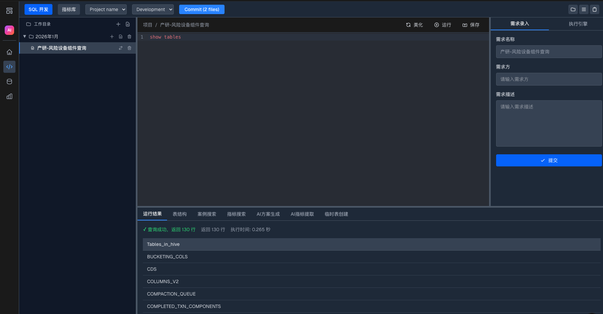

<div align="right">

[English](README_EN.md) | [中文](README.md)

</div>

# TAF-DataDev - 企业级 SQL 开发编辑器

<div align="center">


**专为数据工程师打造的现代化 SQL 开发环境**

[](LICENSE)
[](https://www.python.org/)
[](https://www.typescriptlang.org/)
[](https://nextjs.org/)

</div>

## 📖 项目简介

TAF-DataDev 是一个专为 SQL 开发设计的企业级开发环境，集成了数据库连接管理、SQL 编辑、查询执行、表结构查看、指标管理等核心功能。与通用代码编辑器（如 Cursor、VS Code）不同，TAF-DataDev 专注于数据开发场景，提供了开箱即用的数据库操作能力和智能化的 SQL 开发体验。

## ✨ 核心特性

### 🎯 专为 SQL 开发优化

- **智能 SQL 编辑器**：基于 CodeMirror 6，提供语法高亮、自动补全、代码格式化
- **多数据库支持**：支持 MySQL、PostgreSQL、SQLite 等多种数据库
- **实时查询执行**：一键执行 SQL，即时查看结果
- **表结构查看**：可视化查看数据库表结构，包括字段、类型、约束等信息
- **临时表创建**：支持从 Excel、JSON、CSV 文件快速创建临时表

### 🚀 企业级功能

- **项目管理系统**：支持目录结构管理，项目需求录入和追踪
- **指标库管理**：集中管理业务指标，支持指标分类和搜索
- **案例搜索**：快速搜索历史 SQL 案例和解决方案
- **AI 智能助手**：
  - **AI 方案生成**：根据需求自动生成 SQL 解决方案
  - **AI 指标提取**：从 SQL 语句中智能提取业务指标

### 🎨 现代化 UI

- **可调整面板布局**：支持拖拽调整面板大小，灵活的工作区配置
- **暗色主题**：护眼的暗色主题，适合长时间开发
- **响应式设计**：适配不同屏幕尺寸

## 🆚 与主流编辑器的对比

| 特性 | TAF-DataDev | Cursor | VS Code | DataGrip |
|------|-------------|--------|---------|----------|
| **SQL 专用优化** | ✅ 专为 SQL 设计 | ❌ 通用编辑器 | ❌ 通用编辑器 | ✅ 数据库 IDE |
| **数据库连接管理** | ✅ 内置支持 | ❌ 需插件 | ❌ 需插件 | ✅ 内置支持 |
| **表结构可视化** | ✅ 一键查看 | ❌ 需插件 | ❌ 需插件 | ✅ 支持 |
| **临时表创建** | ✅ 文件上传 | ❌ 不支持 | ❌ 不支持 | ❌ 不支持 |
| **指标库管理** | ✅ 内置功能 | ❌ 不支持 | ❌ 不支持 | ❌ 不支持 |
| **AI SQL 生成** | ✅ 内置 AI | ✅ AI 辅助 | ❌ 需插件 | ❌ 需插件 |
| **项目需求管理** | ✅ 内置 | ❌ 不支持 | ❌ 不支持 | ❌ 不支持 |
| **Web 端访问** | ✅ 浏览器即用 | ❌ 桌面应用 | ❌ 桌面应用 | ❌ 桌面应用 |
| **开源免费** | ✅ 完全开源 | ❌ 部分功能付费 | ✅ 开源 | ❌ 商业软件 |

### 为什么选择 TAF-DataDev？

1. **零配置开箱即用**：无需安装插件，所有 SQL 开发功能内置
2. **Web 端部署**：支持团队协作，无需本地安装
3. **数据开发全流程**：从需求管理到 SQL 开发到指标管理，一站式解决
4. **基于 Apache 顶级项目**：采用成熟稳定的技术栈，企业级可靠性

## 🏗️ 技术架构

### 前端技术栈

- **Next.js 16**：基于 React 的全栈框架，提供 SSR 和路由能力
- **CodeMirror 6**：现代化的代码编辑器，提供强大的编辑体验
- **TypeScript**：类型安全的 JavaScript，提升代码质量
- **Tailwind CSS**：实用优先的 CSS 框架，快速构建 UI

### 后端技术栈

- **Flask**：轻量级 Python Web 框架，快速构建 API
- **SQLAlchemy**：Python 最流行的 ORM，支持多种数据库
- **LangChain**：AI 应用开发框架，支持多种 LLM 模型
- **Flask-SQLAlchemy**：Flask 的 SQLAlchemy 扩展

### 数据库支持

- **MySQL**：通过 PyMySQL 驱动支持
- **PostgreSQL**：通过 psycopg2 驱动支持
- **SQLite**：内置支持，适合本地开发

## 📸 功能截图



## 🚀 快速开始

### 环境要求

- Python 3.13+
- Node.js 18+
- npm 或 yarn

### 安装步骤

1. **克隆项目**

```bash
git clone https://github.com/your-org/TAF-DataDev.git
cd TAF-DataDev
```

2. **启动后端服务**

```bash
cd data-engine-api
# 安装依赖（推荐使用 uv）
uv sync
# 或使用 pip
pip install -r requirements.txt

# 启动 Flask 服务
python main.py
```

后端服务将在 `http://localhost:5000` 启动

3. **启动前端服务**

```bash
cd data-engine-web
npm install
npm run dev
```

前端服务将在 `http://localhost:3000` 启动

4. **访问应用**

打开浏览器访问 `http://localhost:3000`

## 📚 使用指南

### 数据库连接

1. 进入"数据库"页面
2. 点击"添加数据库连接"
3. 填写连接信息（MySQL/PostgreSQL/SQLite）
4. 测试连接并保存

### SQL 开发

1. 进入"SQL 开发"页面
2. 在右侧面板选择数据库连接
3. 编写 SQL 语句
4. 点击"运行"按钮执行查询
5. 在底部面板查看运行结果

### 表结构查看

1. 在右侧"执行引擎"面板选择数据库
2. 选择要查看的表
3. 点击"查看表结构"按钮
4. 在底部"表结构"标签页查看详细信息

### 临时表创建

1. 在底部面板切换到"临时表创建"标签
2. 点击上传按钮选择文件（Excel/JSON/CSV）
3. 输入临时表名
4. 点击"创建临时表"按钮

## 🛠️ 开发

### 项目结构

```
TAF-DataDev/
├── data-engine-api/          # 后端 API 服务
│   ├── api/                  # API 路由
│   │   ├── database.py       # 数据库连接管理
│   │   └── editor.py         # 编辑器相关 API
│   ├── models/               # 数据模型
│   └── main.py               # Flask 应用入口
├── data-engine-web/          # 前端 Web 应用
│   ├── app/                  # Next.js 页面
│   ├── components/           # React 组件
│   ├── contexts/            # React Context
│   └── lib/                 # 工具函数
└── pic/                      # 项目截图
```

### 贡献指南

我们欢迎所有形式的贡献！请查看 [CONTRIBUTING.md](CONTRIBUTING.md) 了解详细信息。

## 📄 许可证

本项目采用 [Apache License 2.0](LICENSE) 许可证。

## 🙏 致谢

本项目使用了以下优秀的开源项目：

- [Next.js](https://nextjs.org/) - React 全栈框架
- [Flask](https://flask.palletsprojects.com/) - Python Web 框架
- [SQLAlchemy](https://www.sqlalchemy.org/) - Python SQL 工具包
- [CodeMirror](https://codemirror.net/) - 代码编辑器
- [LangChain](https://www.langchain.com/) - AI 应用开发框架

## 📞 联系我们

- 项目 Issues: [GitHub Issues](https://github.com/your-org/TAF-DataDev/issues)
- 项目讨论: [GitHub Discussions](https://github.com/your-org/TAF-DataDev/discussions)

---

<div align="center">

**⭐ 如果这个项目对你有帮助，请给我们一个 Star！**

Made with ❤️ by TAF Team

</div>
